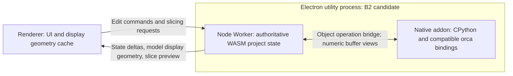

# Native Python Plugin Architecture

**Date:** 2026-10-02

**Status:** Major architecture specification. Electron utility hosting and threaded NODEFS are delivered with bounded Windows validation; Python is not implemented.

**Scope:** Native Python plugins for Electron, libslic3r bridging, runtime data transfer, and Web compatibility.

**Related:** [Grand Plan](Grand%20Plan.md), [Shared Application Architecture](Web-Electron%20Shared%20Application%20Architecture.md).

## 1. Document Status and Decision Boundaries

At the user's request, this document lives directly in `spec/` as a maintained
architecture record alongside the Grand Plan, without separate phase documents.
It records discussions as of the date above. Recording a proposal does not
itself authorize implementation or approve every alternative. The user has
subsequently authorized initial validation of the Electron utility deployment;
see section 12. Python bridging and the remaining design alternatives are still
subject to review.

Confirmed goals and direction:

- Execute Python plugins only in Electron, with the runtime hosted by a native
  Electron addon rather than compiled to WASM.
- Python integration is supported only with the threaded WASM runtime. Serial
  mode has no Python plugin support: no CPython initialization, plugin dispatcher,
  Python execution, or copying compatibility backend. This includes Python
  G-code post-processing and other plugin services, not only geometry access.
- Preserve compatibility with existing OrcaSlicer Python plugins as directly as
  possible, prioritizing unchanged plugin source and observable API behavior.
- Minimize runtime copying, especially when plugins traverse, read, and modify geometry.
- Refine option B: compatible object proxies and operation bridging.
- Keep the Web application usable without introducing Electron, Node, or CPython
  dependencies into the shared application.
- Implement and validate the initial Electron utility migration. Python and
  plugin capabilities remain at the design stage; preserve the pinned submodule.

Open decisions include whether B2 becomes the final deployment after validation,
the implementation of native shared-memory views, plugin delivery order, and
unsupported-host interaction rules for projects that
depend on plugins.

## 2. Alternatives and the Role of Option B

| Option | Approach | Benefits | Main costs and decision |
| --- | --- | --- | --- |
| A: Snapshots and batch writeback | Export selected context to Python and apply changes afterward | Clear boundaries and straightforward isolation | High copying and writeback costs; difficult to preserve writable views, aliases, and immediately observable mutations. Not the selected direction. |
| B: Compatible object proxies | Expose the existing Python API; dispatch object operations to authoritative WASM state and share numeric data where feasible | Retains the WASM core while balancing source compatibility and copying costs | Requires object lifetime management, synchronous calls, and native memory views. Selected for further refinement. |
| C: Native desktop core | Run both libslic3r and CPython natively in Electron | Closer to existing pybind bindings of native objects | Separate desktop/Web core builds and execution paths increase maintenance and consistency costs. Not the selected direction. |

Option B does not allow the existing pybind implementation to bind unchanged to
WASM objects. Native CPython cannot interpret WASM addresses as native `Print*`,
`std::vector`, or Eigen objects. The host object layer must be adapted while
preserving the `orca` module name, decorators, classes, enums, method signatures,
configuration, and callback semantics wherever possible. Source compatibility is
not a promise of cross-target ABI compatibility for arbitrary third-party C++ extensions.

## 3. Existing Code Foundations

- The existing [plugin manager](../packages/slicer-wasm/cpp/src/slic3r/plugin/PluginManager.cpp)
  uses [PythonPluginBridge.cpp](../packages/slicer-wasm/cpp/src/slic3r/plugin/PythonPluginBridge.cpp)
  as the native binding entry. It depends on services from the original wxWidgets
  GUI and cannot be imported wholesale into the existing WASM build.
- [PluginHooks.cpp](../packages/slicer-wasm/cpp/src/slic3r/plugin/PluginHooks.cpp)
  installs capability resolution, slicing pipeline, and lifecycle hooks.
  [Print.hpp](../packages/slicer-wasm/cpp/src/libslic3r/Print.hpp) already exposes
  `set_slicing_pipeline_hook_fn`, keeping libslic3r independent of Python.
- [Print.cpp](../packages/slicer-wasm/cpp/src/libslic3r/Print.cpp) already contains
  stage callbacks. Plugins run at newly completed stages; preserve stage caching
  and invalidation instead of rerunning plugins on every query.
- `slice` / `slicePlate` in [client.ts](../packages/slicer-wasm/src/client/client.ts)
  operate on persistent project state. Slicing requests send configuration and
  target information rather than resending every model.
- [bootstrap.ts](../packages/slicer-runtime/src/bootstrap.ts) already supports
  transport injection. Electron uses a Node Worker in a utility process; Web
  retains its browser Worker. Section 12 defines current host behavior.
- [CMakeLists.txt](../packages/slicer-wasm/CMakeLists.txt) declares `web,worker,node`
  environments, wasm64, and growable memory. These are prerequisites for Node
  hosting; the validation scope remains bounded by section 12.

## 4. Two Deployment Choices for B

| Deployment | WASM | Native Python | Main tradeoff |
| --- | --- | --- | --- |
| B1 | Browser Web Worker in the renderer | Utility process | Retains the existing display-data path; plugin geometry access crosses processes and needs copying, mirroring, or additional shared memory. |
| B2 | Node Worker inside a utility process | Native addon in the same utility process | May share WASM numeric buffers directly; returning display data adds IPC cost, and runtime adaptation and failure recovery become more complex. |

Validate B2 first because the existing API includes writable NumPy views, not
only read-only snapshots. This recommendation is not a final deployment decision.
B2 still executes WASM libslic3r; it is not option C.
Both deployment candidates restrict Python integration to threaded WASM.



## 5. Data Ownership and Copying Budget

B2 must keep the sole authoritative slicing project state in the utility process.
The renderer owns UI state and display projections, not a second complete core
object graph that must be synchronized before each slice.

| Operation | Expected transfer and copying |
| --- | --- |
| Open a model/project | Transfer bytes once when supplied by the renderer; direct utility access to authorized local files is a separate possible design. |
| Display a model initially | Return the required vertices and indices to the renderer; GPU upload is still necessary. |
| Move, rotate, or change configuration | Send object identifiers and transform/configuration deltas, not the entire mesh. |
| Start slicing | Send control information such as plate identifiers and configuration; reuse the resident project. |
| Access intermediate geometry from a plugin | Stay inside B2 without routing through the renderer; aim to avoid copying numeric views. |
| Display slicing results | Return potentially large preview data and include it in the total cost. |
| Modify display geometry | Update affected geometry and invalidate associated caches; a notification alone cannot refresh the display. |
| Save/export | Produce files or bytes on request, without serializing the entire project at each hook. |

The existing path is not entirely zero-copy either:
[modelGeometry.ts](../packages/slicer-wasm/src/client/modelGeometry.ts) exports
independent buffers with `HEAPU8.slice()`, while
[worker.ts](../packages/slicer-wasm/src/client/worker.ts) collects transferables to
avoid another copy of ordinary buffers between a browser Worker and the renderer.
A utility process MessagePort is not an equivalent zero-copy guarantee. Direct
ports reduce forwarding, but actual copying still requires measurement.
Cross-process shared display buffers are a separate optimization, not a
prerequisite for B2.

Do not describe B2 as globally zero-copy or inherently faster. Compare the copies
saved by repeated plugin access against the added IPC cost for model and preview
output. Retain unchanged display geometry caches to avoid resending on every refresh.

## 6. Additional Bridges Between libslic3r and Python

| Boundary | Required semantics and work |
| --- | --- |
| Capability resolution and plugin registration | Synchronize native plugin identities, enablement, and capability registration into the bridge; preserve name/UUID resolution and references to plugins that have not executed. |
| Slicing hooks | Inject a dispatcher through existing Print hooks; preserve stages, objects, ordering, cancellation, and error propagation. |
| Context object graph | Bridge handles, properties, and methods for Print, PrintObject, Layer, LayerRegion, SurfaceCollection, Surface, Polygon, and related objects without copying the whole Print. |
| Geometry operations | Execute offset, collection mutations, `Layer.make_slices()`, and similar operations in WASM with existing cache maintenance; do not duplicate geometry algorithms in Python. |
| Numeric arrays | Add buffer descriptors with ownership and lifetime, distinguishing borrowed views from existing copy/free return values. |
| Model and mesh | Preserve object identifiers, transforms, and read-only mesh snapshot semantics; retain mesh ownership in WASM. |
| Configuration | Adapt presets, scopes, and plugin overrides while preserving `get_config()` and existing API serialization rules. |
| Lifecycle and host services | Adapt load/unload, events, logging, UI/pages, printer agents, and other services without directly calling wxWidgets. |
| G-code post-processing | Connect MEMFS output to native working files Python can open, then reintegrate processed output into the result/export flow. |

Key behavioral evidence:

- [PluginHooks.cpp](../packages/slicer-wasm/cpp/src/slic3r/plugin/PluginHooks.cpp)
  reads `slicing_pipeline_plugin` from static print configuration and the dynamic
  `plugins` manifest from `full_print_config()`. These sources are not interchangeable.
  Lifecycle broadcasts and selected pipeline plugins also target different sets.
- [PluginHostSlicing.cpp](../packages/slicer-wasm/cpp/src/slic3r/plugin/host/PluginHostSlicing.cpp)
  mostly exposes live references; `make_slices()` also refreshes geometry caches.
- `Polygon.as_array()` in
  [PluginHostGeometry.cpp](../packages/slicer-wasm/cpp/src/slic3r/plugin/host/PluginHostGeometry.cpp)
  is a writable `int64 (N,2)` view. Point-property edits and array edits must be mutually visible.
- Vertices/triangles in
  [PluginHostMesh.cpp](../packages/slicer-wasm/cpp/src/slic3r/plugin/host/PluginHostMesh.cpp)
  are read-only `float32 (N,3)` / `int32 (M,3)` views. A shared_ptr retains the mesh
  snapshot; face_normals already returns a copy of computed results.
- [PluginBindingUtils.hpp](../packages/slicer-wasm/cpp/src/slic3r/plugin/PluginBindingUtils.hpp)
  defines array layout and conversion rules. Data already returned by value,
  such as transformation matrices, need not become zero-copy.
- `psGCodePostProcess` in
  [PostProcessor.cpp](../packages/slicer-wasm/cpp/src/slic3r/GUI/PostProcessor.cpp)
  uses real working files. A MEMFS path cannot be passed directly to Python `open()`.

Prefer narrow new bridges that reuse existing core hooks. Preserve the pinned
submodule; necessary core changes must use patches or an intentional, documented
submodule update, not ad-hoc edits to pinned sources.

## 7. Object Proxies, Buffers, and Synchronization: Candidate Design

### 7.1 Objects and Calls

Handles should identify at least the runtime, object kind, slot, and generation.
Execution-scoped references also need an invocation lifetime. Python wrappers
should preserve identity and aliases, batch object directories and stable metadata,
and avoid one RPC per point. WASM addresses are validated numeric-buffer offsets,
not pointers to native C++ objects.

Locally constructing Python points/polygons and uploading them in one batch is
worth investigating, but method, assignment, and alias semantics must remain
intact. Deferring every mutation until hook completion would break immediate reads.

### 7.2 Shared Views and Lifetime

A candidate buffer descriptor includes memory identity, offset, length, dtype,
shape, strides, a read-only flag, and an owner lease. The native addon exposes the
numeric span to NumPy, whose array base retains the owner. The complete
Node-API/NumPy path must be validated in a real Electron build before promising zero-copy.

- Borrowed slicing references follow the existing API's execute lifetime;
  container reallocation invalidates old references.
- Read-only mesh snapshots cannot all expire when a hook returns. They need
  independent retained ownership in WASM.
- Generations can protect proxy methods but cannot automatically intercept raw
  pointer or derived-view access from NumPy. Expired arrays are not guaranteed to
  throw. Stronger protection requires retention, deferred release, or copying.
- After shared memory grows, an old view does not automatically cover the new
  region; acquire a new view for the new range. Validate native backing-store
  retention rather than caching an unmanaged heap pointer indefinitely.
- Serial WASM is outside Python integration scope. No serial memory-view strategy
  or copying compatibility backend will be added.

An initial read-only probe on Electron 43.4.0 / Node 24.18.1 confirmed shared
wasm64 memory creation, growth, and visibility of the shared prefix through old
views. No native addon was built, and the utility Node Worker -> Node-API -> NumPy
path was not validated. This observation is not acceptance of a zero-copy prototype.

### 7.3 Synchronous Callbacks and Failures

While WASM slicing waits for Python, Python may synchronously call WASM offset
or make_slices. If both sides simply block waiting for each other, they deadlock.
The candidate protocol needs restricted command handling during hook waits so
the slicing thread that owns the objects can service allowed plugin operations.
It must not permit arbitrary scene editing or a second slice to reenter the core.

The threaded execution path in
[bridge_slicing_pipeline.cpp](../packages/slicer-wasm/src/bridge_slicing_pipeline.cpp)
must be validated for hook waits and reverse calls. Serial execution receives no
Python callback protocol or dispatcher.
The GIL is not a WASM object lock; bridge waits must avoid holding it in ways that
deadlock callbacks. Native background threads must also respect V8 thread affinity.

Direct view writes take effect immediately and provide no automatic transaction
rollback. After plugin failure or cancellation, discard or invalidate affected
slice results/caches rather than reusing completed steps that were partially
mutated. Recovery granularity remains to be designed. A native crash in B2 ends
both the Python and WASM sessions. The renderer may survive, but the session must
be rebuilt. Forcibly terminating a plugin thread is not safe cancellation;
project recovery after process termination also belongs in the design.

## 8. Web Compatibility and Host Boundaries

The shared React application continues to use a common `slicer-runtime` interface.
`slicer-wasm/src/client/` remains the only JavaScript boundary that directly
accesses Emscripten. B2 changes the Electron execution host without adding native
dependencies to Web.

| Layer | Web | Electron B2 candidate |
| --- | --- | --- |
| Application, project editing, preview | Shared | Shared |
| Application-facing slicing interface | Same contract | Same contract |
| Transport | Browser Worker | preload/MessagePort |
| WASM deployment | Browser Web Worker | Node Worker in utility |
| Python execution | Unavailable in both WASM modes | Native addon + CPython in threaded mode only; unavailable in serial mode |

Separate host entry points are required; conditionally executing a statically
imported Node dependency inside shared code is insufficient. Shared UI should
use capability declarations, such as the proposed `pythonPlugins`, to expose
entry points. The runtime must also reject unsupported execution requests. Web
does not install a Python dispatcher, and the core stays independent of Python/Node
headers and libraries.

Python capability must depend on the active runtime variant, not merely the
Electron host or the availability of threaded artifacts. If runtime selection
falls back to serial, Python capability remains unavailable and CPython is not
initialized. Unsupported execution requests must fail explicitly; a slice that
requires a Python plugin must not silently skip it. Ordinary serial slicing
remains supported. The detailed UI and project reference-preservation rules for
unsupported execution remain subject to review, including Electron serial mode.

Prioritize sharing the same WASM artifacts across hosts. Node needs resource
location, profile installation, pthread startup, and capability detection adapted;
browser `crossOriginIsolated` / WebGL startup checks cannot be reused directly.
If Electron-specific artifacts ultimately become necessary, document the build
differences and consistency checks without accidentally diverging core semantics.

The following project round-trip rules are proposals for review:

| Situation | Proposed behavior |
| --- | --- |
| Ordinary project | Preserve existing Web editing, slicing, and export behavior. |
| Plugin configuration/references present | Allow opening, editing, and saving while preserving all related data. |
| Current slice depends on a plugin Web cannot execute | Explain the limitation and block that slice rather than silently skipping the plugin. |
| User explicitly disables the plugin before slicing | Allow slicing and record disablement as a visible configuration change. |
| Plugin installed but not enabled for the current project | Do not affect slicing. |

Preserving references and executing plugins are separate capabilities. Acceptance
must cover Electron -> Web edit/save -> Electron round trips without losing
capability identities, manifests, or configuration overrides.

## 9. Packaging, Compatibility, and Delivery Boundaries

Native runtime delivery needs a separate versioning and platform-packaging design
for CPython, `.node` modules, NumPy, and plugin dependencies. The current
[electron-builder.yml](../apps/desktop/electron-builder.yml) dependency policy does
not establish support for these native files. Loading, unloading, discovery,
dependency installation, and host services are part of compatibility, but their
delivery order remains open. Native Python plugins can execute local code;
utility process isolation must not be described as a Python plugin sandbox.

Validate unchanged existing plugin source first, covering geometry mutation,
read-only inspection, configuration/UI, and G-code file post-processing. An
approximate `execute(ctx)` implementation alone does not establish compatibility
with the existing plugin system.

## 10. Future Validation Plan and Decision Gates

These are planned steps, not claims of completed or passing validation.

1. **Native memory prototype:** Validate shared wasm64 -> addon -> NumPy visibility
   in both directions, dtype/shape/read-only rules, memory growth, release order,
   and long-lived mesh retention. Reassess B2's benefits if this fails.
2. **Synchronous protocol prototype:** Call geometry operations back from hooks,
   covering cancellation and exceptions in threaded execution. Verify no deadlocks
   or invalid core reentrancy. Separately verify that serial mode, including an
   automatic fallback, never initializes CPython or dispatches Python plugins and
   rejects plugin-dependent execution while ordinary slicing remains usable.
3. **Plugin behavior comparison:** Compare representative existing plugins such
   as Inset, Fuzzy, Twistify, Inspector, and G-code stamp against original Orca
   results, configuration, array semantics, and errors. Establish the actual
   fixture list from available examples.
4. **Copying and memory measurements:** Track renderer IPC, WASM exports, plugin
   input/output bytes, control-call counts, peak memory, and retained buffers.
   Compare a no-plugin baseline with geometry-intensive plugins. Do not invent
   performance multipliers or degrade hot paths into per-vertex RPC.
5. **Host integration:** Validate projects/history/multiple plates, preview,
   resource loading, packaged dependencies, and crash recovery. Web coverage must
   include both existing WASM variants, ordinary workflows, and plugin-project
   round trips without native module dependencies.

Follow the [testing guidelines](../doc/testing_guidelines.md) for check frequency.
The Python prototypes and plugin tests above are not implemented. Section 12
records the authorized utility migration and its measured results.

## 11. Open Questions for Further Discussion

- Whether to adopt B2, and acceptable renderer-transfer budgets and recovery boundaries.
- The first required plugin set and the scope/order of non-slicing host services.
- Unsupported-host UI, explicit disablement, and round-trip preservation rules for Web and Electron serial mode; Python execution in these modes is excluded.
- Native view lifetime guarantees, synchronization, and cache invalidation details.

## 12. Delivered Utility Host and Temporary-file Boundary

This step migrates only the existing Electron slicing runtime. It adds no Python,
plugin APIs, or other product features. Use existing real projects and fixtures to
compare behavior and performance; successful startup alone does not establish feasibility.

- Main manages one utility lifecycle per window document and hands MessagePorts
  to the renderer and utility. Requests/results travel directly without per-message
  forwarding through main or contextBridge.
- A Node Worker inside utility executes the existing typed client and WASM while
  the utility event loop handles communication. Transfer independent ArrayBuffers
  between Workers to avoid another clone of large input after Electron IPC.
- Browser and Node hosts share module selection, mock fixtures, profile installation,
  serial/threaded modes, and the business protocol. Only module/resource loading
  and messaging differ: Electron reads local resources; Web retains its browser Worker.
- Reload/close terminates the old utility. Unexpected exit rejects pending and
  subsequent operations without automatically replaying edits. Explicit reload
  creates a new session; automatic project recovery is outside this step.
- Native packaging validation includes asar/unpacked resource access, not only development paths.
- Staging declares `type: module` in `public/wasm/package.json`, copied with assets
  into build and unpacked directories. This declares ESM for generated JS and
  pthread loading while preserving the Electron main process's CommonJS type.

Validation includes existing Electron mock regressions, real import/slice/export,
large multi-plate projects, history and interaction performance, new process
reload/exit checks, and Web threaded/serial compatibility. Use existing performance
budgets and same-machine A/B measurements of startup, import, slice-to-preview,
export, and process working sets. Summed working sets are not private or peak memory.
Do not relax budgets to pass failing tests. Section 12.1 records the limits of the available validation.

Test builds can set both `VITE_E2E=1` and `VITE_RUNTIME_BASELINE=1` to run the old
browser Worker baseline; production builds do not expose this fallback. The new
[runtime-performance.e2e.ts](../apps/desktop/e2e/runtime-performance.e2e.ts) uses the
existing cube fixture, while
[utility-runtime.e2e.ts](../apps/desktop/e2e/utility-runtime.e2e.ts) checks process
ownership and reload behavior.

### 12.1 Validation scope

Windows x64 utility hosting was exercised with real import/slice/export,
threaded and serial selection, project/history/painting journeys, reload and
exit handling, and Windows packaged resource probes. Existing plate-switch
budgets passed on the verified eleven-plate fixture. Same-machine comparison
showed additional summed process working sets (approximately 150–165 MiB);
these are not private memory or peak usage, and small timing differences are
not a speedup guarantee. Cross-process results still incur copying; native
shared-memory views were not implemented.

An initial Prime Tower history run observed two projection reads where one
was expected. Subsequent repeated runs passed without relaxing the assertion;
the initial discrepancy has no confirmed root cause. Retain the stability
check. macOS/Linux packaging, prolonged stress and arbitrary extremely large
projects remain outside this validation. Utility success does not validate
native Python/NumPy views or close the remaining B2 design questions.

### 12.2 Reproduction Commands

With current WASM artifacts available, run `pnpm stage:assets` first. Run the
following PowerShell commands from the repository root to measure utility. Use
the environment variables only in this test shell and close it afterward:

```powershell
$env:VITE_USE_MOCK = '0'
$env:VITE_E2E = '1'
$env:ORCA_E2E_REAL = '1'
pnpm --filter @orca/desktop exec electron-vite build
pnpm --filter @orca/desktop exec playwright test e2e/runtime-performance.e2e.ts --repeat-each 3
```

For the baseline, also set `$env:VITE_RUNTIME_BASELINE = '1'`, rebuild, and run the
same test. Remove that variable and rebuild to return to utility; changing it at
runtime does not alter an already built host. Serial verification uses existing
build selectors `VITE_SCOPED_CONFIGURATION_GATE=1` and
`VITE_SCOPED_CONFIGURATION_GATE_VARIANT=serial`, without adding a user-facing switch.

Equivalent packaging commands using the locally cached Electron distribution:

```powershell
pnpm --filter @orca/desktop exec electron-builder --dir --publish never --config.electronDist=node_modules/electron/dist
$env:ORCA_E2E_PACKAGED_ROOT = 'release/win-unpacked'
pnpm --filter @orca/desktop exec playwright test e2e/packaged-real.e2e.ts e2e/packaged.e2e.ts
```

Build with real WASM as above before packaging. Production builds must not set
the test baseline variable.

### 12.3 NODEFS Temporary-file Validation (2026-10-02)

#### Scope

Validate the existing temporary-file workflows using one shared threaded WASM artifact in Electron and Web. Electron threaded mounts a session-specific native temporary directory through NODEFS; Web and serial retain MEMFS. No Python runtime, plugin execution, or post-processing feature is included.

#### Implementation

The existing threaded target links `-lnodefs.js`. Electron main creates one
`os.tmpdir()/orca-slicer-XXXXXX` directory per utility session and passes its
absolute path privately to the utility's Node Worker. The typed WASM client
mounts it at `/tmp` after the module factory resolves, before profile installation
or `orc_init`. Startup fails if NODEFS is missing or `/tmp` already contains
files; it never silently mounts over existing data.

The host setup follows the **successfully loaded** variant. Web has no native
directory option. Electron serial, including threaded-load fallback, retains
MEMFS. The remaining filesystem, including `/system` profiles, stays in MEMFS.
This uses a selective NODEFS mount, not NODERAWFS.

| Existing workflow | Temporary location | Handling |
| --- | --- | --- |
| Model upload, including STL/DRC/STEP | `/tmp/<sanitized filename>` | Existing upload retention lasts until session exit. |
| Slicer log | `/tmp/orca.log` | Same logger and flush policy; the file is created lazily when a record passes the configured severity filter. |
| Generation G-code | `/tmp/plate-result-<plate>-<incarnation>-<generation>.gcode` | Moved from the filesystem root; result receipts, replacement, preview indexing and export semantics are unchanged. |
| Project import/export | `/tmp/orca-project-<sequence>.3mf` and normalization/`.tmp` siblings | Existing per-operation cleanup remains in effect. |
| STEP preprocessing | `/tmp/temp.step` | `orc_init` now initializes `Slic3r::temporary_dir()` to `/tmp`. |
| Native model backup/3MF staging | `/tmp/orcaslicer_model/...` | Uses the same `Slic3r::temporary_dir()` setting. |

Source owners are
[`bridge_model_operations.cpp`](../packages/slicer-wasm/src/bridge_model_operations.cpp),
[`bridge_slicing_pipeline.cpp`](../packages/slicer-wasm/src/bridge_slicing_pipeline.cpp),
[`bridge_project_persistence.cpp`](../packages/slicer-wasm/src/bridge_project_persistence.cpp),
and the pinned upstream `STEP.cpp` / `Model.cpp`. The superproject gitlink
owns the current native revision.

Main removes the exact owned directory after the utility exits, so open native
handles are closed first. Reloaded documents retain independent cleanup for
their old sessions. Normal application quit waits for outstanding process exits
and directory removal. A stop requested before Electron assigns a utility PID
is retried on `spawn`; unit tests cover immediate quit and document replacement.
Node Worker exit terminates its utility so main can clean up.

#### Compatibility and verification requirements

Both hosts use the same threaded WASM/data artifacts; no host-specific WASM
compilation is required. Web's existing loader transform sanitizes unreachable
Node JavaScript branches. Test the unmodified shared threaded outputs as well
as the normal Web build, and assert the selected variant rather than assuming
that a successful startup used threads.

The native-file suite must compare normal export with File Manager bytes,
exercise GPU preview and paged source lines, replace result generations,
roundtrip 3MF settings, and cover reload, utility/renderer crash and normal
quit cleanup. Use a native temporary path containing spaces and non-ASCII
characters. A renderer-crash check must finish before relaunching; a
Playwright Page disconnected by a crash cannot be reused. Serial fallback
must keep MEMFS and leave the owned native directory empty. The dedicated
`nodefs-bridge-smoke.mjs` covers native files, cancellation and superseded
result checks; ordinary serial smoke covers its unchanged filesystem path.

Electron build and focused checks:

```powershell
$env:VITE_USE_MOCK = '0'
$env:VITE_E2E = '1'
$env:VITE_SCOPED_CONFIGURATION_GATE = '1'
$env:VITE_SCOPED_CONFIGURATION_GATE_VARIANT = 'threaded'
pnpm --filter @orca/desktop exec electron-vite build
$env:ORCA_E2E_REAL = '1'
$env:ORCA_E2E_NODEFS_EXPECT_VARIANT = 'threaded'
pnpm --filter @orca/desktop exec playwright test e2e/nodefs-runtime.e2e.ts
pnpm --filter @orca/desktop exec playwright test e2e/app.e2e.ts --grep 'real DRC flow|real STEP flow'
```

For the focused serial check, rebuild with
`VITE_SCOPED_CONFIGURATION_GATE_VARIANT=serial` and run the native-file test with
`ORCA_E2E_NODEFS_EXPECT_VARIANT=serial`. The latter only asserts the selected
runtime; it does not select an artifact.

Web compatibility checks use a fresh preview server:

```powershell
$env:CI = 'true'
$env:VITE_USE_MOCK = '0'
Remove-Item Env:ORCA_WEB_NO_ISOLATION -ErrorAction SilentlyContinue
pnpm --filter @orca/desktop exec playwright test --config ../../apps/web/playwright.config.ts e2e/nodefs-compatibility.e2e.ts e2e/step-import.e2e.ts e2e/web.e2e.ts --grep 'unchanged shared|real Web flow|real Web STEP'
$env:ORCA_WEB_NO_ISOLATION = '1'
pnpm --filter @orca/desktop exec playwright test --config ../../apps/web/playwright.config.ts e2e/step-import.e2e.ts e2e/web.e2e.ts --grep 'real Web flow|real Web STEP'
```

#### Performance scope

NODEFS functional validation excluded performance acceptance. No latency,
throughput or memory-regression conclusion follows from that validation; the
utility-host comparison in section 12.1 has its own scope.

#### Limits

- This is a Windows feasibility check for existing temporary-file workflows,
  not full release qualification. macOS/Linux, packaged installers and disk-full
  recovery are not qualified by these results.
- Abrupt termination of Electron main or the machine cannot run cleanup. No
  startup orphan-directory scavenger was introduced. Cleanup failures are
  logged after bounded filesystem retries.
- NODEFS avoids keeping an additional MEMFS backing copy of files under
  `/tmp`. Existing model upload, preview transport and full-buffer export APIs
  retain their copies; this change is not an end-to-end zero-copy conversion.
- Native path availability does not change preview caching or authorize
  external mutation of indexed G-code.
