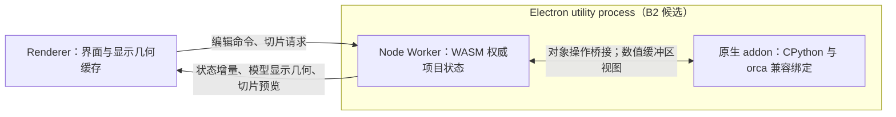

# Native Python Plugin Architecture

**日期：** 2026-10-02

**状态：** 重大架构 spec；讨论基线，尚未实施。已确认目标与待审阅方案分别记录。

**范围：** Electron 原生 Python 插件、libslic3r 桥接、运行时数据传输及 Web 兼容。

**关联：** [Grand Plan](Grand%20Plan.md)、[共享应用架构](Web-Electron%20Shared%20Application%20Architecture.md)。

## 1. 文档地位与决策边界

本文按用户要求直接落在 `spec/`，作为与 Grand Plan 同级的持续维护架构记录，
不另建并行阶段文档。记录截至本日期的讨论；文档落地不代表授权实现，也不代表
所有备选设计已获批准。现行共享应用架构仍然有效；本文提出的 Electron Worker
部署位置调整，需要在后续讨论中确定后再实施。

已确认的目标与方向：

- Python 插件仅在 Electron 中执行，运行时通过原生 Electron addon 承载，不编译为 WASM。
- 尽可能直接兼容已有 OrcaSlicer Python 插件，优先保持插件源码和可观察 API 行为。
- 尽量减少运行时数据复制，特别是插件遍历、读取和修改几何的热路径。
- 选择方案 B（兼容对象代理与操作桥接）继续细化。
- 保持 Web 版可用，共享应用不能被迫依赖 Electron、Node 或 CPython。
- 当前仅进行设计和文档工作，不修改功能代码或 submodule。

尚未确认的设计：B1/B2 部署选择、原生共享内存视图的具体实现、serial 回退策略、
插件能力交付顺序，以及 Web 打开依赖插件项目时的最终交互规则。

## 2. 方案比较与 B 的定位

| 方案 | 核心做法 | 优点 | 主要代价与结论 |
| --- | --- | --- | --- |
| A：快照与批量写回 | 将选定上下文导出给 Python，执行后应用变更 | 边界清楚，易隔离 | 数据复制和写回成本高，难保留可写视图、对象别名和立即可见的修改语义；不是当前细化方向 |
| B：兼容对象代理 | Python 暴露原有 API；对象操作转到权威 WASM 状态，数值数据尽量共享 | 保留 WASM 核心，兼顾源码兼容与复制成本 | 需要完整处理对象寿命、同步调用和原生内存视图；用户已选择继续细化 |
| C：桌面原生核心 | Electron 原生侧同时运行 libslic3r 与 CPython | 更接近现有 pybind 对原生对象的绑定 | 桌面/Web 形成两套核心构建和执行路径，维护与一致性成本明显增加；不是当前方向 |

B 不意味着原有 pybind 代码可以原样链接到 WASM 对象。原生 CPython 无法直接把
WASM 地址当成本机 `Print*`、`std::vector` 或 Eigen 对象使用。必须适配宿主对象层，
同时尽可能保留 `orca` 模块名、装饰器、类、枚举、方法签名、配置和回调语义。
源码兼容目标不等于承诺任意第三方 C++ 扩展具有跨编译目标的 ABI 兼容性。

## 3. 当前代码提供的基础

核对基线：文档分支从远程 main 的 `f17229e7033a70eded4764da781bfc1b3dfdb183`
建立；Orca submodule 为 `489cbe91840ff97aaf4d8029009d5db410f32893`。

- 原有插件实现位于 [plugin](../packages/slicer-wasm/cpp/src/slic3r/plugin/PluginManager.cpp)，
  原生 Python 绑定入口是 [PythonPluginBridge.cpp](../packages/slicer-wasm/cpp/src/slic3r/plugin/PythonPluginBridge.cpp)。
  插件管理器依赖原 wxWidgets GUI 等宿主服务，不能直接整体引入现有 WASM 构建。
- [PluginHooks.cpp](../packages/slicer-wasm/cpp/src/slic3r/plugin/PluginHooks.cpp)
  安装 capability resolver、切片流水线和生命周期三个 hook。
  [Print.hpp](../packages/slicer-wasm/cpp/src/libslic3r/Print.hpp)
  已有 `set_slicing_pipeline_hook_fn`，使 libslic3r 不需要依赖 Python。
- [Print.cpp](../packages/slicer-wasm/cpp/src/libslic3r/Print.cpp) 已有阶段回调位置。
  插件在新完成的阶段执行，阶段缓存与失效语义必须保留，不能每次查询都重新执行插件。
- [client.ts](../packages/slicer-wasm/src/client/client.ts) 的 `slice` / `slicePlate`
  使用常驻项目状态，切片请求发送配置及目标信息，不每次重新发送全部模型。
- [bootstrap.ts](../packages/slicer-runtime/src/bootstrap.ts) 已有 transport 注入切口；
  [默认客户端入口](../packages/slicer-runtime/src/slicer/slicerClient.ts) 和
  [Worker 入口](../packages/slicer-runtime/src/slicer/slicer.worker.ts) 仍依赖浏览器启动方式。
- [CMakeLists.txt](../packages/slicer-wasm/CMakeLists.txt) 声明 `web,worker,node` 环境、
  wasm64 和可增长内存。这是 Node 承载的基础，不是完整桌面宿主已经验证的证明。

## 4. B 的两个部署选择

| 部署 | WASM | 原生 Python | 主要取舍 |
| --- | --- | --- | --- |
| B1 | renderer 的浏览器 Web Worker | utility process | 保留当前显示数据路径；插件几何交互跨进程，需要复制、镜像或额外共享内存设计 |
| B2 | utility process 内 Node Worker | 同一 utility process 的原生 addon | 有机会直接共享 WASM 数值缓冲区；显示数据回传增加跨进程成本，运行时适配和故障恢复更复杂 |

当前建议优先验证 B2，因为既有 API 包含可写 NumPy 视图，而不仅是只读快照。
此建议尚未成为最终部署决策。B2 仍运行 WASM libslic3r，不是方案 C。

## 5. 数据归属与复制预算

B2 必须把唯一的权威切片项目状态常驻在 utility process。renderer 持有界面状态和
显示投影，不持有另一套需要在每次切片前整体同步的完整核心对象图。

| 操作 | 传输与复制预期 |
| --- | --- |
| 打开模型/项目 | 从 renderer 提供字节时传一次；桌面可另行设计由 utility 直接读取获准打开的本地文件 |
| 初次显示模型 | 将显示所需顶点、索引回传 renderer；仍需 GPU 上传 |
| 移动/旋转/改配置 | 传对象标识及变换、配置增量，不重传整个 mesh |
| 发起切片 | 传盘标识和配置等控制信息，复用常驻项目 |
| 插件访问中间几何 | B2 内部完成，不经过 renderer；数值视图争取避免复制 |
| 显示切片结果 | 回传预览数据，可能很大，必须计入整体开销 |
| 修改显示几何 | 更新受影响几何并使对应缓存失效；仅发通知不足以刷新画面 |
| 保存/导出 | 按用户请求产生文件或字节，不在每次 hook 序列化整个工程 |

当前也不是全程零复制：[modelGeometry.ts](../packages/slicer-wasm/src/client/modelGeometry.ts)
用 `HEAPU8.slice()` 导出独立缓冲区；[worker.ts](../packages/slicer-wasm/src/client/worker.ts)
收集 transferables，避免 Worker 到 renderer 的普通数组再复制。
utility 跨进程 MessagePort 不应被当作等价的零复制保证。直连端口可以减少中转，
但真实复制次数仍需测量；跨进程共享显示缓冲区属于独立优化，不是 B2 成立的前提。

因此不能宣称 B2 整体零复制或必然更快。应比较插件侧反复访问省下的复制，与模型、
预览输出新增的 IPC 成本；保留未变化显示几何缓存，避免每次刷新重传。

## 6. libslic3r 与 Python 之间需要增加的桥接

| 边界 | 应保留的语义与需要补齐的工作 |
| --- | --- |
| capability 解析与插件注册 | 将原生侧插件身份、启用状态及 capability 注册同步到桥接层；保持名称/UUID 引用解析，不能丢弃未执行的插件引用 |
| 切片 hook | 在现有 Print hook 注入 dispatcher；保留步骤、对象、执行顺序、取消和错误传播 |
| 上下文对象图 | 为 Print、PrintObject、Layer、LayerRegion、SurfaceCollection、Surface、Polygon 等提供句柄、属性与方法桥接；不是复制整个 Print |
| 几何计算 | offset、集合修改、`Layer.make_slices()` 等回到 WASM 核心执行，保留缓存维护；不在 Python 侧重写另一套几何算法 |
| 数值数组 | 增加带所有权和寿命的缓冲区描述，区分借用视图与现有 copy/free 返回值 |
| Model 与 mesh | 保留对象标识、变换和只读 mesh 快照语义；mesh 引用需在 WASM 侧保活 |
| 配置 | 适配预设、作用域和插件覆盖配置，保留 `get_config()` 与原 API 序列化规则 |
| 生命周期与宿主服务 | 适配加载/卸载、事件、日志、UI/pages、printer agent 等；不能直接调用 wxWidgets GUI |
| G-code 后处理 | 将 MEMFS 结果与 Python 可打开的原生工作文件衔接，执行后重新接入结果/导出流程 |

关键行为依据：

- [PluginHooks.cpp](../packages/slicer-wasm/cpp/src/slic3r/plugin/PluginHooks.cpp)
  从静态 print config 取 `slicing_pipeline_plugin`，从 `full_print_config()` 取动态
  `plugins` manifest；两者不可混用。生命周期广播与选中的流水线插件也不是同一集合。
- [PluginHostSlicing.cpp](../packages/slicer-wasm/cpp/src/slic3r/plugin/host/PluginHostSlicing.cpp)
  暴露的对象多为实时引用；`make_slices()` 还会刷新相关几何缓存。
- [PluginHostGeometry.cpp](../packages/slicer-wasm/cpp/src/slic3r/plugin/host/PluginHostGeometry.cpp)
  的 `Polygon.as_array()` 是可写 `int64 (N,2)` 视图；点属性修改与数组修改必须相互可见。
- [PluginHostMesh.cpp](../packages/slicer-wasm/cpp/src/slic3r/plugin/host/PluginHostMesh.cpp)
  的 vertices/triangles 是只读 `float32 (N,3)` / `int32 (M,3)` 视图，mesh 由 shared_ptr
  保持快照寿命；face_normals 本来就是计算结果副本。
- [PluginBindingUtils.hpp](../packages/slicer-wasm/cpp/src/slic3r/plugin/PluginBindingUtils.hpp)
  包含数组布局与转换规则；变换矩阵等原本按值返回的数据不必强求零复制。
- [PostProcessor.cpp](../packages/slicer-wasm/cpp/src/slic3r/GUI/PostProcessor.cpp)
  的 `psGCodePostProcess` 使用真实工作文件，不能把 MEMFS 路径直接交给 Python `open()`。

实现优先新增窄桥接并复用已有核心 hook。保持 submodule 固定；确需核心改动时，
通过补丁或有意记录的 submodule 更新完成，不直接编辑 pinned 源码。

## 7. 对象代理、缓冲区与同步语义（候选设计）

### 7.1 对象与调用

句柄应至少识别运行时、对象种类、槽位和 generation；执行期引用另有 invocation
寿命。Python 包装层应保持同一对象的身份/别名关系，批量读取对象目录和稳定元数据，
避免每个点一次 RPC。WASM 地址仅作为受校验的数值缓冲区偏移，不能转换为原生 C++ 对象。

Python 新建的点/多边形可以研究本地构建后一次上传，但必须保持方法、赋值和别名
语义；不能为了批处理把所有修改延迟到 hook 结束，破坏插件的即时读取结果。

### 7.2 共享视图与寿命

候选缓冲区描述包含 memory 身份、偏移、长度、dtype、shape、strides、只读标记和
owner lease。原生 addon 将数值跨度交给 NumPy，数组 base 保留 owner；具体
Node-API/NumPy 链路必须在真实 Electron 构建中验证后才能承诺零复制。

- 切片对象的借用引用遵守原 API 的 execute 有效期；容器重分配会使旧引用失效。
- 只读 mesh 快照不能简单在 hook 结束时全部失效，需要独立的 WASM 所有权保活。
- generation 可保护代理方法，却不能自动拦截 NumPy 持有的裸指针或派生视图访问。
  不承诺过期数组会自动抛出异常。更强保护需要额外保活、延迟释放或复制。
- shared memory 增长后，旧视图长度不会自动覆盖新区域；新范围需重新取得视图。
  必须验证 native backing store 保活，不能无限期缓存一个未经管理的堆指针。
- serial 的非共享内存增长会带来旧缓冲区分离问题；不能沿用 threaded 的裸指针方案。
  serial 的复制兼容后端或其他策略仍待选择，不能默认为具有相同的零复制能力。

前期只读探测在本机 Electron 43.4.0 / Node 24.18.1 中确认了 shared wasm64 内存
创建、增长及旧视图对共享前缀的可见性。尚未构建原生 addon，也未验证 utility
Node Worker → Node-API → NumPy 的完整链路；该观察不是零复制原型验收。

### 7.3 同步回调与失败处理

WASM 切片等待 Python 时，Python 可能同步调用 WASM 的 offset 或 make_slices。
若两边只阻塞等待对方，会死锁。候选实现需要在 hook 等待期间提供受限命令处理，
让拥有对象的切片线程服务允许的插件操作；不能任意重入场景编辑或第二次切片。

[bridge_slicing_pipeline.cpp](../packages/slicer-wasm/src/bridge_slicing_pipeline.cpp)
中 threaded 与 serial 执行位置不同；serial 同步切片占用 Worker，不能依赖该 Worker
此时继续处理普通 JS 消息。此协议必须分别验证。GIL 不是 WASM 对象锁，等待桥接时
要避免持有导致回调死锁的 GIL；原生后台线程也不能直接调用只允许在所属线程调用的 V8 API。

直接视图写入立即生效，没有免费事务回滚。插件失败或取消后，应丢弃或使受影响的
切片结果/缓存失效，不能复用已标记完成但被部分修改的步骤。具体恢复粒度待设计。
B2 中原生崩溃会同时终止 Python 与 WASM 会话；renderer 可存活，但会话需重建。
强制终止插件线程不是安全取消方式；进程终止后的工程恢复也必须纳入方案。

## 8. Web 兼容与宿主边界

共享 React 应用继续通过 `slicer-runtime` 使用统一接口；唯一直接访问 Emscripten 的
JS 边界仍为 `slicer-wasm/src/client/`。B2 只改变 Electron 执行宿主，不把原生依赖引入 Web。

| 层 | Web | Electron B2 候选 |
| --- | --- | --- |
| 应用、项目编辑、预览 | 共用 | 共用 |
| 应用可见的切片接口 | 同一契约 | 同一契约 |
| transport | 浏览器 Worker | preload/MessagePort |
| WASM 部署 | 浏览器 Web Worker | utility 内 Node Worker |
| Python 执行 | 不提供 | 原生 addon + CPython |

需要拆分宿主入口；不能只在共享模块中条件执行一个静态导入的 Node 依赖。
共享 UI 使用能力声明（例如拟议的 `pythonPlugins`）控制入口，运行时同样拒绝不支持
的执行请求。Web 不安装 Python dispatcher，核心仍不依赖 Python/Node 头文件或库。

优先研究两个宿主复用相同 WASM 产物。Node 端需适配资源定位、profile 安装、pthread
启动和能力检测，不能直接套用浏览器的 `crossOriginIsolated` / WebGL 启动判断。
若最终需要 Electron 专用产物，必须明确构建差异和一致性验证，不能无意分叉核心语义。

以下项目往返规则是待审阅建议：

| 情况 | 建议行为 |
| --- | --- |
| 普通项目 | Web 保持现有编辑、切片、导出行为 |
| 包含插件配置/引用 | 允许打开、编辑和保存，完整保留相关数据 |
| 当前切片依赖 Web 不能执行的插件 | 明确提示并阻止该次切片，不静默跳过 |
| 用户明确禁用插件后切片 | 允许执行，禁用作为可见的配置修改 |
| 只是安装了插件、当前项目未启用 | 不影响切片 |

保留引用的能力与执行插件的能力必须分开。验收需覆盖 Electron → Web 编辑保存 →
Electron 的往返，防止 Web 丢失 capability 身份、manifest 或配置覆盖。

## 9. 包装、兼容性和交付边界

原生运行时需要单独设计 CPython、`.node`、NumPy/插件依赖的版本与分平台打包。
当前 [electron-builder.yml](../apps/desktop/electron-builder.yml) 的依赖打包策略不能被
视为已经支持这些原生文件。加载、卸载、插件发现、依赖安装与宿主服务都属于兼容范围，
但其具体交付顺序尚未确定。原生 Python 插件具有本机执行能力；utility 的进程隔离
不能被宣传为 Python 插件沙箱。

优先以原有插件源码不修改为验证方式，覆盖几何修改、只读检查、配置/UI 与 G-code
文件后处理；仅实现一个近似的 `execute(ctx)` 不足以宣称兼容现有插件系统。

## 10. 待实施的验证计划与决策门槛

以下是后续实施方案，不代表已经运行或通过。

1. **原生内存原型：** 验证同进程 shared wasm64 → addon → NumPy 双向可见性、
   dtype/shape/只读规则、内存增长、释放顺序与长期 mesh 保活。失败则重新评估 B2 优势。
2. **同步协议原型：** hook 内反向调用几何操作，覆盖取消、异常、threaded/serial；
   验证不会死锁，也不会非法重入核心。
3. **插件行为对照：** 以已有 Inset、Fuzzy、Twistify、Inspector、G-code stamp 等
   代表性插件，对照原 Orca 的修改结果、配置、数组与错误语义；用实际可用样例建立清单。
4. **复制与内存度量：** 分别统计 renderer IPC、WASM 导出、插件输入/输出的字节数、
   控制调用次数、峰值内存和保留缓冲区；比较无插件基线和重几何插件场景。
   不使用未经测量的固定性能倍数；热路径不得退化成逐顶点 RPC。
5. **宿主集成：** 验证项目/历史/多盘、预览、资源加载、打包后的依赖和崩溃恢复。
   Web 覆盖两种现有 WASM 变体、普通流程及插件项目往返，不包含原生模块依赖。

检查频率遵循 [testing guidelines](../doc/testing_guidelines.md)。本文只记录设计，
未执行上述原型或功能测试。后续继续在本文更新确定的选择，避免把候选方案误记为交付状态。

## 11. 下一轮讨论待定项

- 是否采用 B2，以及接受的 renderer 数据传输预算与故障恢复边界。
- serial 下保留何种插件兼容能力，是否接受复制后端及其限制。
- 首轮必须兼容的插件集合，以及非切片宿主服务的范围和顺序。
- Web 对插件依赖项目的阻止切片、显式禁用与往返保存规则。
- 原生视图的寿命保障、同步协议和缓存失效的具体实现。
